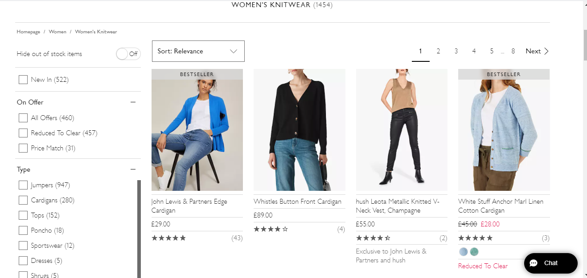
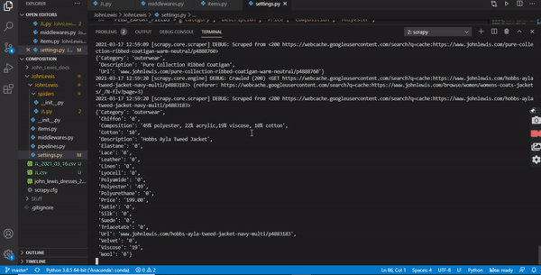

# Introduction

This project is all about scraping websites to retrieve data using the Python framework scrapy. My wife is interested in clothing, fashion and statistics so we decided to scrape the UK John Lewis website for our own research and personal interest.
The aim was to build an effective and ethical scraping script, so I scrape via google cache at a very pedestrian rate of about two clicks per minute.

## Quick Demo

## Technologies

Python 3.9, Scrapy 2.4.1, Black

## Known Issues

Scrapy have deprecated the FEED_URI and FEED_FORMAT settings in the settings.py file. Although they work as they are, the newer implementation is desirable. 
Some errors produced by the parse_item method in the JL.py file result in data loss. 

## Project Status

On hold. 
###### To do:
- use newer scrapy implementation of data feed to a CSV file
- improve parse_item method in JL.py to maximise data collection
- improve efficiency and post-processing using scrapy built-in features
